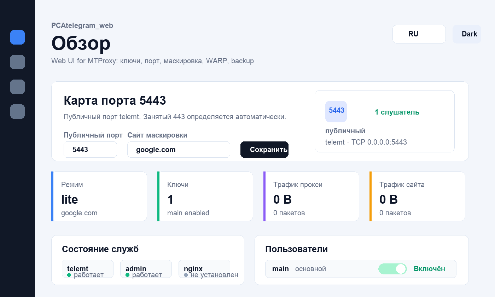

# PCAtelegram_web

Отдельный проект PCAtelegram_web: MTProxy на базе `telemt`, Telegram-бот, локальная web-admin панель, статистика, backup/restore, шаблоны сайта.

> Поддержать проект: [Boosty](https://boosty.to/andrey27/donate) · [Ozon Bank](https://finance.ozon.ru/apps/sbp/ozonbankpay/019dc200-2a5d-7931-a619-782d285f6798) · [Telegram](https://t.me/PCAdministration) · [GitHub](https://github.com/andrey271192/PCAtelegram_web)



## Что умеет

- Web-admin для управления MTProxy без ручного редактирования TOML.
- Создание, отключение, удаление ключей и лимит IP на пользователя.
- Выбор публичного порта и сайта маскировки FakeTLS.
- Автоустановка `telemt`, если прокси-ядро отсутствует при сохранении маршрута.
- WARP / WARP+ настройки, backup/restore, статистика трафика.
- Session cookie переживает restart web-admin; auto-refresh не сбрасывает поля во время ввода.

## Установка

На сервере под `root`:

```bash
curl -fsSL https://raw.githubusercontent.com/andrey271192/PCAtelegram_web/main/bootstrap.sh | bash
```

Если репозиторий private, первый `curl` тоже должен получить GitHub token:

```bash
curl -fsSL -H "Authorization: Bearer $GITHUB_TOKEN" \
  https://raw.githubusercontent.com/andrey271192/PCAtelegram_web/main/bootstrap.sh | \
  GITHUB_TOKEN="$GITHUB_TOKEN" bash
```

После установки команда доступна как:

```bash
pcatelegram_web
```

## Локальная проверка без GitHub

```bash
rsync -a ./ root@SERVER:/opt/pcatelegram_web/
ssh root@SERVER 'chmod +x /opt/pcatelegram_web/install.sh /opt/pcatelegram_web/install_pcatelegram_web_bot.sh /opt/pcatelegram_web/lib/*.sh && ln -sf /opt/pcatelegram_web/install.sh /usr/local/bin/pcatelegram_web && pcatelegram_web'
```

## Состав

| Путь | Назначение |
| --- | --- |
| `bootstrap.sh` | загружает файлы проекта в `/opt/pcatelegram_web` и запускает меню |
| `install.sh` | основное CLI-меню PCAtelegram_web |
| `install_pcatelegram_web_bot.sh` | отдельная установка Telegram-бота |
| `lib/` | общие функции, telemt, nginx/site, stats, backup, i18n |
| `pcatelegram_web-bot/` | Python Telegram bot |
| `admin-web/` | локальная web-admin панель |
| `templates_catalog.json` | каталог HTML-шаблонов |

## Переменные

| Переменная | По умолчанию | Описание |
| --- | --- | --- |
| `PCATELEGRAM_WEB_BASE` | `https://raw.githubusercontent.com/andrey271192/PCAtelegram_web/main` | база загрузки файлов |
| `PCATELEGRAM_WEB_INSTALL_DIR` | `/opt/pcatelegram_web` | путь установки |
| `GITHUB_TOKEN` / `GH_TOKEN` | пусто | token для private GitHub raw downloads |
| `PCATELEGRAM_WEB_ADMIN_HOST` | `0.0.0.0` | bind web-admin |
| `PCATELEGRAM_WEB_ADMIN_PORT` | `1984` | port web-admin |
| `PCATELEGRAM_WEB_ADMIN_USER` | `admin` | Basic Auth login |
| `PCATELEGRAM_WEB_ADMIN_PASSWORD` | `admin` | web-admin password |
| `PCATELEGRAM_WEB_WARP_CONFIG` | `/opt/pcatelegram_web/warp.json` | WARP / WARP+ settings |

## Поддержка

- **GitHub:** [andrey271192/PCAtelegram_web](https://github.com/andrey271192/PCAtelegram_web)
- **Boosty:** [boosty.to/andrey27/donate](https://boosty.to/andrey27/donate)
- **Ozon Bank:** [ссылка](https://finance.ozon.ru/apps/sbp/ozonbankpay/019dc200-2a5d-7931-a619-782d285f6798)
- **Telegram:** [PCAdministration](https://t.me/PCAdministration)

## Web-admin

После первого запуска `pcatelegram_web` web-admin панель ставится как `pcatelegram_web-admin.service` и слушает публично:

```bash
http://SERVER:1984/
```

Логин и пароль по умолчанию: `admin` / `admin`. Данные можно сменить в web-admin Settings. Текущие данные хранятся на сервере:

```bash
sudo cat /root/pcatelegram_web-admin.password
```

Для своего пароля передайте env до установки:

```bash
PCATELEGRAM_WEB_ADMIN_PASSWORD='strong-password' bash bootstrap.sh
```

Без HTTPS Basic Auth гонит пароль открытым текстом. Для постоянного доступа лучше reverse proxy с TLS, но порт `1984` открыт по умолчанию по запросу проекта.

## WARP / WARP+

В web-admin Settings есть блок `WARP / WARP+`:

- `Off` — WARP выключен.
- `WARP` — обычный Cloudflare WARP.
- `WARP+` — WARP+ с license key.
- `All clients` — если `warp-cli` не установлен, web-admin ставит `cloudflare-warp`, затем применяет WARP на весь proxy-трафик через `warp-cli`.
- `One client` — если `warp-cli` не установлен, web-admin ставит `cloudflare-warp`, затем сохраняет WARP/WARP+ профиль и key для выбранного клиента в `/opt/pcatelegram_web/warp.json`.

WARP+ key не отдается в API целиком: web показывает только маску. Файл `warp.json` хранится с правами `0600` и входит в backup.

Для real global WARP web-admin использует официальный Cloudflare Linux repo: добавляет GPG key, repo `pkg.cloudflareclient.com`, ставит пакет `cloudflare-warp`, затем выполняет регистрацию `warp-cli registration new`, WARP+ key `warp-cli registration license <KEY>`, подключение `warp-cli connect`.

Per-client runtime routing в текущем telemt не включается автоматически: публичные параметры telemt дают users/limits/quotas/ad tags, но не документируют привязку upstream к конкретному user. Для настоящего WARP только одному клиенту нужен отдельный telemt route/service или upstream-схема.

## Порт и маскировка

В web-admin Settings есть блок `Port and mask site`:

- `Public port` — реальный порт `telemt` (`[server] port`) и порт в tg-ссылках (`[general.links] public_port`).
- `Mask site` — сайт маскировки FakeTLS (`[censorship] tls_domain`), который вшивается в `ee` secret.
- Перед сохранением web-admin проверяет порт через `ss`. Если порт занят не `telemt` (например, Xray / 3x-ui на 443), сохранение блокируется.
- После сохранения обновляются `/etc/telemt/config.toml`, `/opt/pcatelegram_web/config.json`, ссылки клиентов и перезапускается `telemt`.

Один `telemt`-инстанс имеет один публичный порт и один сайт маскировки для всех клиентов. Разные порты или разные сайты маскировки на разных клиентов требуют отдельные `telemt` services/configs.

## Ошибки и решения

### Telegram пишет `соединение` и proxy не подключается

Причины:

- `telemt` не запущен.
- Порт закрыт firewall/VPS provider.
- В Telegram осталась старая ссылка со старым secret.

Проверка:

```bash
systemctl is-active telemt
ss -tulpn | grep -E ':(443|5443)\b'
journalctl -u telemt --since "10 min ago" -n 80 --no-pager
```

Решение:

- В web-admin открой `Keys`, скопируй свежую ссылку нужного пользователя и заново добавь proxy в Telegram.
- Если `telemt` отсутствует, в web-admin сохрани `Port and mask site`: панель поставит `telemt`, создаст `main`, запустит сервис.
- Если порт не слушает, перезапусти:

```bash
systemctl restart telemt
systemctl status telemt --no-pager -l
```

### `unauthorized` при создании ключа

Обычно это старая вкладка после restart web-admin.

Решение:

- Обнови страницу и войди снова.
- Начиная с cache `admin26` session cookie переживает restart, а при настоящем `401` UI отправляет на login.

Проверка:

```bash
systemctl is-active pcatelegram_web-admin.service
journalctl -u pcatelegram_web-admin --since "10 min ago" -n 80 --no-pager
```

### Не меняется `Лимит IP`, поле скачет или откатывается

Причина: auto-refresh перерисовал карточку пользователя во время ввода.

Решение:

- Начиная с cache `admin28` background refresh не трогает страницу, пока курсор находится в `input`, `select` или `textarea`.
- Сделай hard refresh браузера после обновления панели: `Ctrl+Shift+R` / `Cmd+Shift+R`.

Проверка через API:

```bash
curl -b cookies.txt -H 'Content-Type: application/json' \
  -H 'X-PCAtelegram-Web-Admin: 1' \
  -d '{"max_unique_ips":2}' \
  http://SERVER:1984/api/users/main/max-ips
```

### Порт `443` занят

Проверка:

```bash
ss -tulpn | grep ':443'
```

Если там `xray`, `3x-ui`, `nginx` или другой процесс, web-admin покажет конфликт и не даст сохранить `telemt` на этот порт. Выбери свободный порт, например `5443`, либо освободи `443` вручную.

### GitHub пишет `Repository not found`

Возможные причины:

- private repo удалён;
- GitHub token больше не имеет доступа;
- `GITHUB_TOKEN` не передан при установке private repo.

Проверка:

```bash
git ls-remote origin HEAD
```

Для private install:

```bash
curl -fsSL -H "Authorization: Bearer $GITHUB_TOKEN" \
  https://raw.githubusercontent.com/andrey271192/PCAtelegram_web/main/bootstrap.sh | \
  GITHUB_TOKEN="$GITHUB_TOKEN" bash
```

### Web-admin не открывается на `:1984`

Проверка:

```bash
systemctl is-active pcatelegram_web-admin.service
ss -tulpn | grep ':1984'
journalctl -u pcatelegram_web-admin --since "10 min ago" -n 80 --no-pager
```

Если сервис работает, но порт не открывается снаружи, проверь firewall/VPS security group.

## Проверки

```bash
bash -n bootstrap.sh install.sh install_pcatelegram_web_bot.sh lib/*.sh lib/lang/*.sh
rg -i "old-brand-name" .
```
